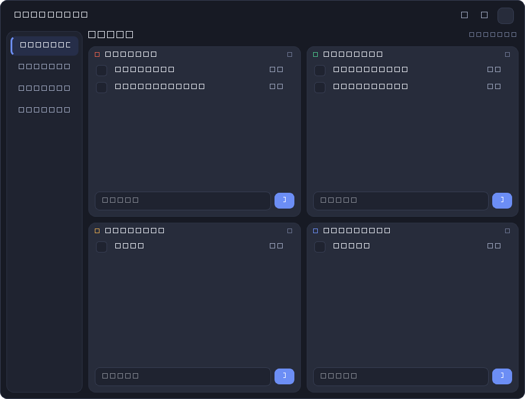
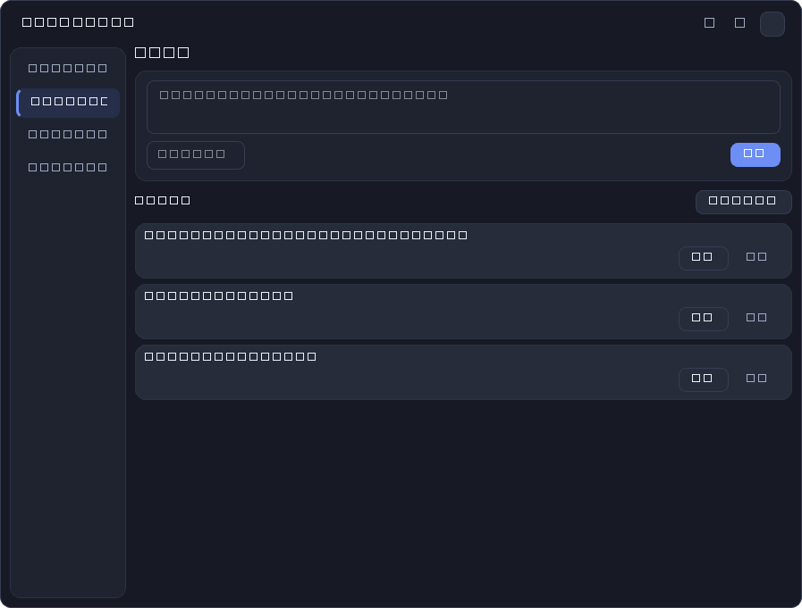
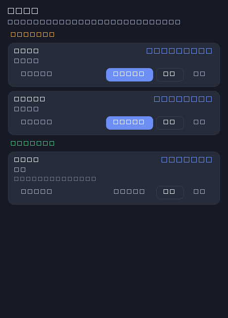
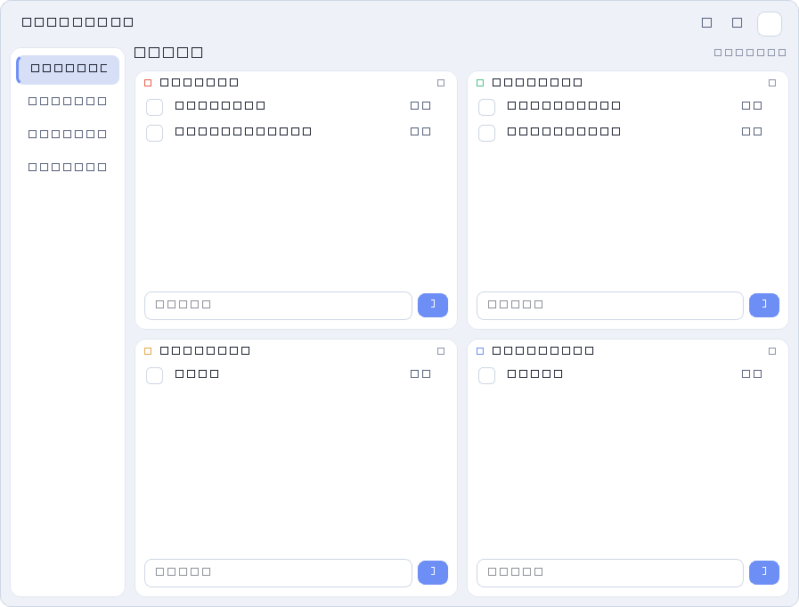
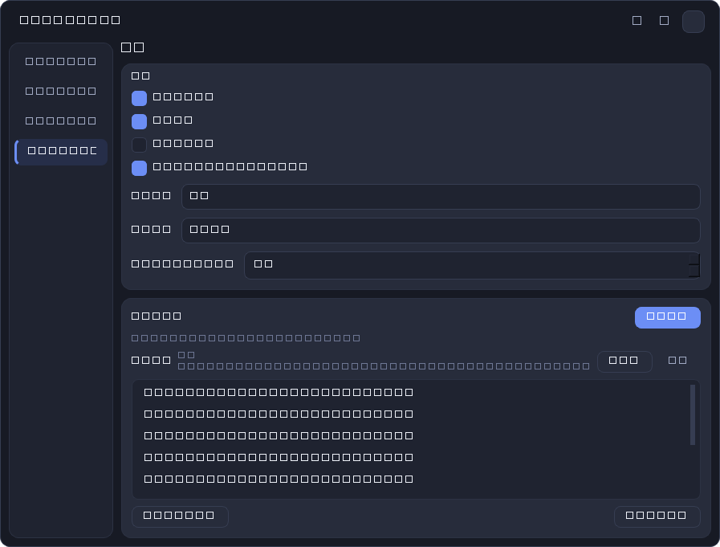

# DeskMateQ · 桌面效率小部件

> 开机自启的无边框桌面小部件, 集成四象限待办、工作日志(周报)、报销记录, 数据自动保存并支持备份/恢复。


DeskMateQ 是一个常驻桌面的轻量效率工具, 用 PySide6 (Qt) 构建。无边框圆角窗口、深色/浅色主题、贴边自动隐藏, 把日常的待办、工作记录和报销整理收纳在一个随手可及的小窗里。

## 📸 界面预览

| 四象限待办 | 工作日志 | 报销记录 |
|:---:|:---:|:---:|
|  |  |  |

| 浅色主题 | 设置 |
|:---:|:---:|
|  |  |

## ✨ 功能

- **四象限 TodoList**: 按艾森豪威尔矩阵 (紧急/重要) 分四象限管理待办, 支持勾选完成、就地编辑、删除。
- **工作日志**: 随手记录已完成工作, 自动记录时间; 卡片内就地编辑; 一键生成并复制当周周报。
- **报销记录**: 待报销/已报销分组, 每条含金额、备注与多个附件 (截图/文件)。支持**拖入文件** (直接拖到卡片或对话框)、一键**打开该项文件夹** (里面正好是这一项的全部文件), 可切换状态、编辑、删除。
- **数据安全**: 所有操作即时写入 SQLite; 支持手动/定时自动备份, 备份位置可自定义, 从任意备份一键恢复 (恢复前自动快照)。7 天前的旧备份只保留一份, 自动清理冗余。
- **桌面体验**:
  - 无边框圆角窗口、深色/浅色主题 (可跟随系统)
  - 标题栏一键置顶
  - **贴边自动隐藏**: 把窗口推到屏幕边缘即吸附, 鼠标离开滑出收起、移到边缘自动滑回 (带滑入滑出动画), 可单独开关自动隐藏
  - 系统托盘常驻、窗口位置与外观持久化、开机自启

## 🚀 运行

需要 Python 3.10+ (Windows)。

```bash
# 1. 创建并激活虚拟环境 (可选但推荐)
python -m venv .venv
.venv\Scripts\activate

# 2. 安装依赖
pip install -r requirements.txt

# 3. 启动
python main.py
```

退出: 通过系统托盘菜单「退出」。点关闭按钮仅最小化到托盘。

## 📦 下载 / 打包

- **直接下载**: 前往 [Releases](https://github.com/qwqqq6/deskmateQ/releases) 下载 `DeskMateQ.exe`, 双击即可运行 (免安装, Windows 64 位)。
- **自行打包**:

  ```bash
  pip install pyinstaller
  pyinstaller --noconfirm --clean --onefile --windowed --name DeskMateQ --icon app.ico main.py
  ```

  产物在 `dist/DeskMateQ.exe`。

## 📂 数据位置

所有数据存放于 `%LOCALAPPDATA%\DeskMate` (不随仓库分发):

```
DeskMate/
├── data/deskmate.db     # SQLite 数据库
├── attachments/         # 报销附件 (按报销项分子目录: attachments/{id}/)
├── backups/             # 自动/手动备份 (zip)
├── logs/
└── config.json          # 用户配置
```

设置面板中「打开数据文件夹」可直接定位整个数据目录; 报销卡片与编辑对话框中的「打开文件夹」则直接定位到该报销项的附件目录, 里面正好是这一项的全部文件。

## 🏗️ 架构

分层设计, 高内聚低耦合, 依赖方向单向向下 (ui → services → repositories → core):

```
app/
├── core/          基础设施: paths(路径) / config(配置) / database(连接与schema)
├── repositories/  数据访问层: models + todo/worklog/reimbursement 仓储
├── services/      业务服务: backup(备份恢复) / autostart(自启) / report(周报)
├── ui/            表现层: main_window 外壳 + 各功能面板 + theme(QSS) + components
└── utils/         通用工具: dates(时间处理) / system(打开文件夹)
main.py            入口: 单实例保护 + 启动
```

- **core** 不依赖任何上层; 仓储仅依赖 core; 服务依赖仓储与 core; UI 编排服务与仓储。
- 数据库用单连接 + 锁保证线程安全, `user_version` 支撑后续迁移。
- 备份打包数据库 + 附件 + 配置为 zip, 按时间戳命名并按上限轮转。

## ⚙️ 开机自启原理

写入注册表 `HKCU\Software\Microsoft\Windows\CurrentVersion\Run`, 仅当前用户、无需管理员权限, 在设置面板可随时开关。

## 🛠️ 技术栈

- [Python](https://www.python.org/) 3.10+
- [PySide6](https://doc.qt.io/qtforpython/) (Qt 6) — GUI
- SQLite — 本地数据存储

## 👤 作者

[@qwqqq6](https://github.com/qwqqq6)

## 📄 许可

本项目基于 [MIT License](LICENSE) 开源。
